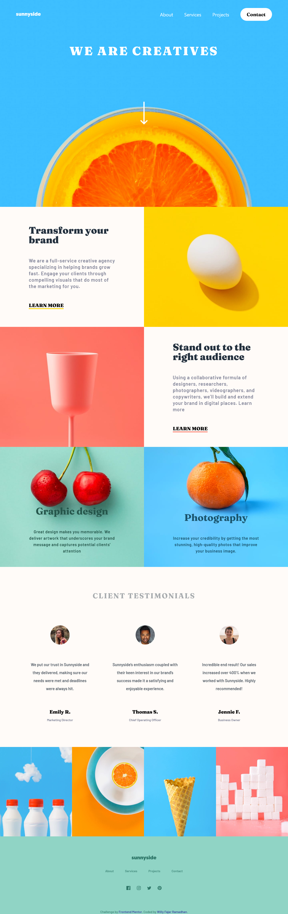
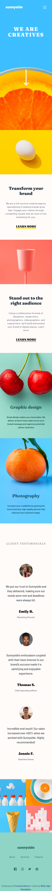
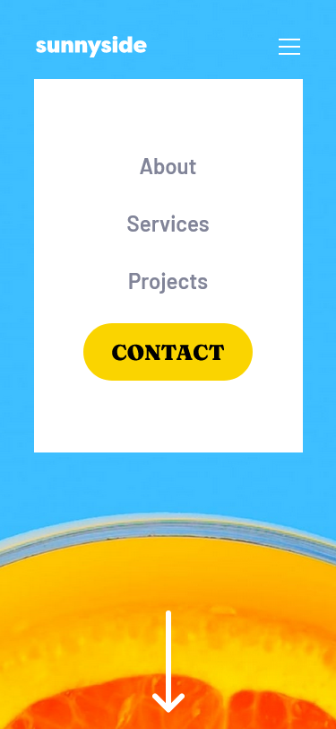

# Frontend Mentor - Sunnyside agency landing page solution

This is a solution to the [Sunnyside agency landing page challenge on Frontend Mentor](https://www.frontendmentor.io/challenges/sunnyside-agency-landing-page-7yVs3B6ef). Frontend Mentor challenges help you improve your coding skills by building realistic projects.

## Table of contents

- [Overview](#overview)
  - [The challenge](#the-challenge)
  - [Screenshot](#screenshot)
  - [Links](#links)
- [My process](#my-process)
  - [Built with](#built-with)
  - [What I learned](#what-i-learned)
- [Author](#author)

## Overview

### The challenge

Users should be able to:

- View the optimal layout for the site depending on their device's screen size
- See hover states for all interactive elements on the page

### Screenshot

Desktop preview:  

Mobile preview:  

Mobile menu preview:  

### Links

- Solution URL: [https://github.com/wllyvx/sunnyside-agency-landing-page]
- Live Site URL: [https://wllyvx.github.io/sunnyside-agency-landing-page/]

## My process

### Built with

- Semantic HTML5 markup
- CSS custom properties
- Flexbox
- CSS Grid
- Mobile-first workflow
- [Tailwind CSS](https://tailwindcss.com/) - For styles

### What I learned

I learned how to make responsive mobile navigation menu using javascript

## Author

- Willy Fajar Ramadhan
- Frontend Mentor - [@wllyvx](https://www.frontendmentor.io/profile/wllyvx)
- Github - [wllyvx](https://github.com/wllyvx)
- Twitter - [@willyframadhan](https://www.twitter.com/willyframadhan)
